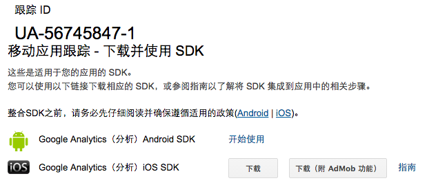

# 海外SDK集成说明

  在海外发行的游戏，需要集成适用于海外推广的SDK，在这里统一做出说明，供各个研发商参考。

## 必选SDK
  以下列出的SDK，在游戏包中为必选集成项目。
### 统计分析
####   Google Analytics
  海外游戏分析，首推Google的统计系统，这个系统不仅能够分析游戏本身的指标和纬度，更能够与Google Play商店和Google Adwords广告系统整合，是游戏自身统计系统的有益补充。
  Google Analytics 首页地址：[http://www.google.com/analytics/](http://www.google.com/analytics/ "http://www.google.com/analytics/")
  首先需要获得游戏的跟踪ID，如下图

  Android版本帮助地址：[https://developers.google.com/analytics/devguides/collection/android/v4/](https://developers.google.com/analytics/devguides/collection/android/v4/ "https://developers.google.com/analytics/devguides/collection/android/v4/")
  IOS版本帮助地址：[https://developers.google.com/analytics/devguides/collection/ios/v3/](https://developers.google.com/analytics/devguides/collection/ios/v3/ "https://developers.google.com/analytics/devguides/collection/ios/v3/")
#####   基本集成
向AndroidManifest.xml文件中添加两个权限
	xml
		<uses-permission android:name="android.permission.INTERNET" />
	          <uses-permission android:name="android.permission.ACCESS_NETWORK_STATE" />
	
### 广告平台
### 社交SDK
### PUSH推送

## 推荐SDK